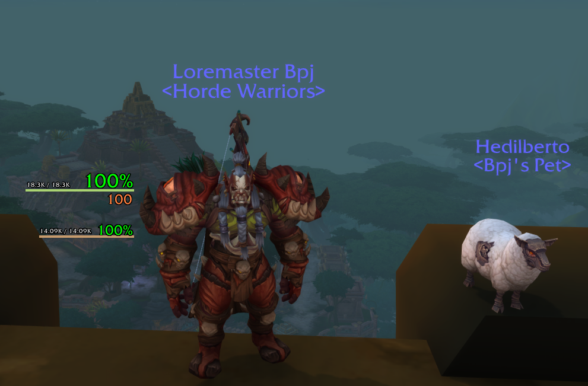

# BettyBoom's simple UI

This is a first attempt to create a simple WoW UI. For now the only active elements are:
 * Player HP, showing `current / total` and current percentage
 * Player power resource (just mana, focus, rage and energy)
 * Pet HP, showing `current / total` and current percentage

The colored bar below the HP is not a StatusBar, it's just a line with the class color.

 ## Example

 
